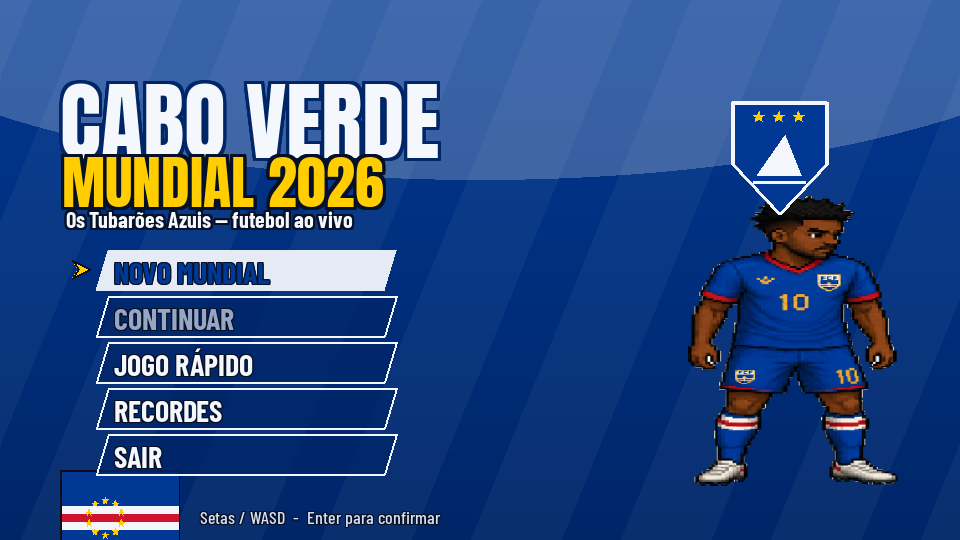
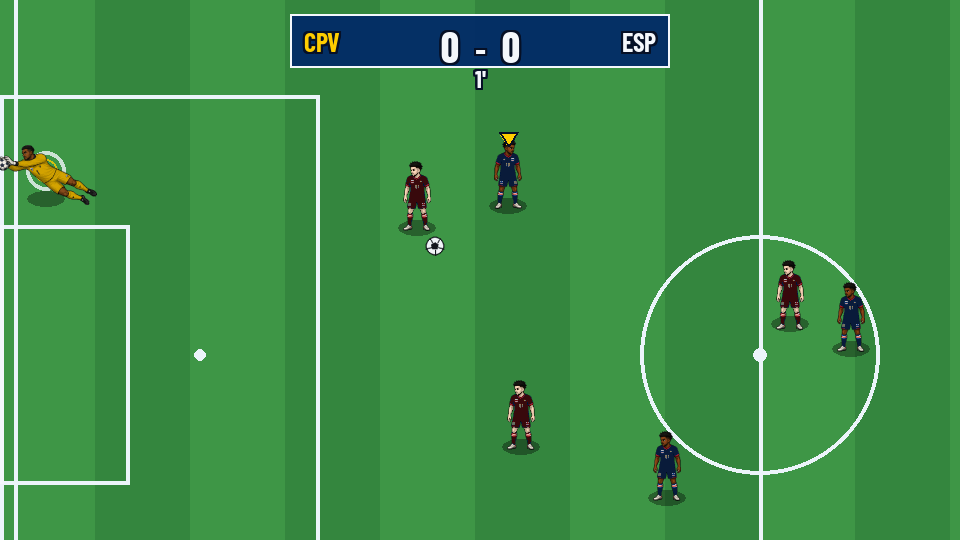
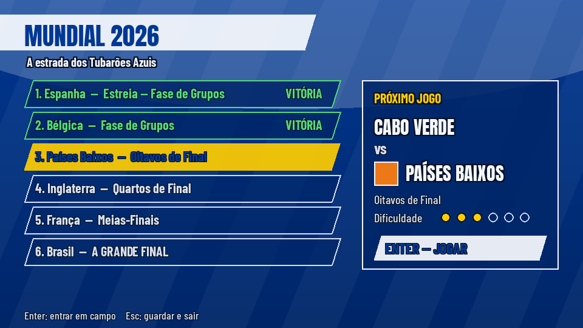
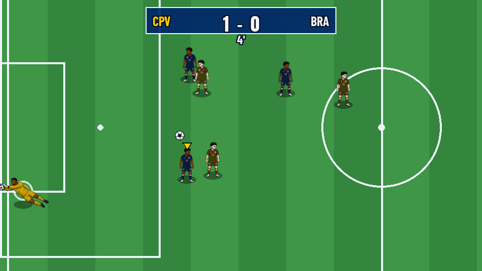
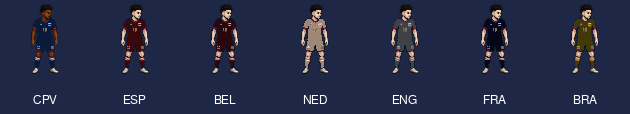

# 🇨🇻 Cabo Verde — Mundial 2026

> *Os Tubarões Azuis, ao vivo, no maior palco do mundo.*

Um **jogo de futebol arcade em vista de cima**, feito em **pygame**, em que pegas na
**Seleção de Cabo Verde** e a levas pela sua **estreia histórica no Campeonato do
Mundo de 2026**. Jogas os jogos **em tempo real** — corres, passas, remates, fazes
entradas — contra o computador, ao estilo *FIFA* / *Sensible Soccer*. Vence e avança;
empata ou perde a eliminatória e estás fora.

Todo o jogo está pintado no **branco e azul** de Cabo Verde e quase toda a interface
está **em português**.



---

## ⚽ Porquê este projeto — a história por trás

Em 2025, **Cabo Verde fez história ao garantir, pela primeira vez, a qualificação para
um Campeonato do Mundo** — o de 2026 (o primeiro com 48 seleções, disputado nos EUA,
Canadá e México). Para um arquipélago de cerca de meio milhão de habitantes, tornar-se
uma das **menores nações de sempre a chegar a um Mundial** é qualquer coisa de
extraordinário. Os **Tubarões Azuis** deixaram de ser apenas uma promessa: passaram a
ser uma seleção que pisa o relvado ao lado das maiores potências do planeta.

Este projeto é uma **homenagem jogável a esse feito**. A *estrada do Mundial* que
percorres no jogo — Espanha, Bélgica, Países Baixos, Inglaterra, França e o Brasil na
final — é, claro, um **sonho ficcional**: o "e se?" da caminhada perfeita. Mas o ponto
de partida é real, e é por isso que cada detalhe respira Cabo Verde: as cores da
bandeira, o brasão, os nomes em português e um guarda-redes lendário a defender a
baliza como se a ilha inteira estivesse atrás dele.



---

## 🔁 De "RPG por Salas" a futebol ao vivo

Este trabalho nasceu de um enunciado académico: **"Jogo RPG por Salas"** — um RPG
simples de exploração, com salas, combate, inventário e inimigos. O projeto foi
**totalmente reformulado** para um jogo de futebol ao vivo, mas **nenhum dos conceitos
pedidos foi abandonado**: cada um tem um equivalente direto no jogo de futebol. A
secção [Requisitos académicos](#-requisitos-académicos--onde-está-cada-coisa) mais
abaixo faz esse mapeamento, peça a peça.

| Conceito original (RPG por Salas) | Como aparece neste jogo de futebol |
|-----------------------------------|------------------------------------|
| **Mapa composto por salas**       | O **relvado** (`game/match/pitch.py`) é a "sala" de cada jogo; a sucessão de salas tornou-se a **estrada do Mundial** com 6 etapas (`WORLD_CUP_PATH`). |
| **Sistema de combate**            | O **jogo ao vivo** (`Match`): remates, passes, entradas, posse de bola e golos resolvidos frame a frame. |
| **Inimigos**                      | As **seleções adversárias**, controladas por IA (`game/match/ai.py`), com dificuldade crescente. |
| **Itens colecionáveis / Inventário** | O que se "coleciona" são **vitórias, golos e recordes**: o estado da campanha (`GameState`) e o **livro de recordes** (`RecordBook`/`RecordEntry`). |
| **Personagem**                    | O **jogador** (`Player`) que controlas no relvado, mais o plantel inteiro. |

---

## 🎮 Como se joga

| Ação            | Teclas              |
|-----------------|---------------------|
| Mover           | Setas / WASD        |
| Sprintar        | Shift               |
| Rematar         | Espaço / K          |
| Passar          | Z / J               |
| Entrada / carga | X / L               |
| Pausa           | Esc                 |

Controlas sempre o jogador de Cabo Verde **mais próximo da bola** (troca automática).
Mantém uma direção enquanto remates para apontar aos cantos; o passe procura o
companheiro mais bem colocado à tua frente.

### Modos de jogo

- **Novo Mundial** — uma campanha completa do Campeonato do Mundo, com progresso
  guardado (cada vitória avança uma etapa; a final é o Brasil).
- **Continuar** — retoma a tua campanha guardada.
- **Jogo Rápido** — um amigável avulso contra uma seleção aleatória.
- **Recordes** — a tabela das tuas melhores campanhas.

---

## 🏟️ A estrada do Mundial

São **seis etapas de dificuldade crescente**. Cada adversário é mais forte do que o
anterior (a IA escala velocidade, alcance de remate e pontaria do guarda-redes), por
isso o Mundial torna-se genuinamente mais difícil à medida que avanças até à final.



---

## 🧤 Vozinha, o muro

À baliza está o **Vozinha**, propositadamente **impossível de bater**. Ele
**teleporta-se** para o ponto exato onde qualquer remate cruzaria a linha de golo e
**varre tudo o que entra na sua área** — até uma bola perdida de um companheiro, o que
também elimina autogolos. Resultado: **Cabo Verde não sofre golos de bola corrida**. O
teu trabalho é marcar do outro lado.



---

## 👕 Os plantéis: um kit, todas as seleções

Existe **uma única arte-base** (renders em pixel da seleção de Cabo Verde). Todas as
outras seleções são **geradas por recoloração em tempo de execução**: a camisola azul
é trocada para a cor da equipa (preservando o sombreado) e o guarda-redes amarelo para
a cor do respetivo guarda-redes. Como a arte-base são jogadores cabo-verdianos, para
**todas as outras seleções o tom de pele também é clareado** (`_RecolorSkin`), para
ficar coerente com esses plantéis. Cabo Verde mantém o seu tom original.



---

## 🎬 Abertura cinematográfica

O jogo abre com uma **cinemática curta e saltável** (estilo TV antiga, com riscas de
varrimento e *vignette*): estática → brasão → o capitão → **Vozinha, o invencível** →
uma investida no relvado → o cartão de título. Prime **Espaço** para saltar.


---

## 🧱 Arquitetura: motor vs jogo (separação lógica / interface)

O código está dividido em duas camadas, e esta separação é o coração do projeto:

- **`engine/`** — o motor **genérico**, que não sabe nada de futebol: janela e ciclo
  principal (`app.py`), pilha de cenas (`scene/`), câmara, ajudas de desenho, input,
  áudio, gestor de *assets* e matemática 2D (`mathx/vec2.py`).
- **`game/`** — o **jogo de futebol** em si: simulação, IA, sprites, cenas e dados.
- **`main.py`** — o **único ficheiro que liga as duas camadas**.

A regra de ouro: **a lógica nunca desenha**. O `Match` (`game/match/match.py`) é
simulação pura — calcula física, posse e golos, mas nunca toca no ecrã. Quem desenha é
a cena (`MatchScene`). Lógica e interface vivem separadas.

---

## ✅ Requisitos académicos — onde está cada coisa

Esta secção mapeia **cada ponto do enunciado** ao sítio onde está implementado.

### Objetivo e requisitos base

| Requisito | Onde / Como |
|-----------|-------------|
| Mapa / "salas" | `game/match/pitch.py` (o relvado) + `WORLD_CUP_PATH` (a sucessão de etapas) |
| Sistema de "combate" | `game/match/match.py` — `Match.Update` (física, posse, remate, golo) |
| Inimigos | `game/match/ai.py` — IA das seleções adversárias, com `ai_skill` crescente |
| Itens / Inventário (coleção) | `game/domain/game_state.py` (`GameState`) e `game/persistence/records.py` (`RecordBook`) |
| Personagem | `game/match/entities.py` (`Player`) |

### Requisitos gerais (obrigatórios)

| Requisito | Como é cumprido |
|-----------|-----------------|
| **Interface gráfica funcional** | **pygame** (equivalente gratuito ao Tkinter) — janela 960×540, render em tempo real. |
| **Mínimo de 4 classes** | Dezenas, p. ex. `Application`, `Scene`, `Match`, `Player`, `Ball`, `Camera`, `Vec2`, `GameState`, `RecordBook`, `SaveManager`, `SpriteFactory`, `TeamDef`, `Menu`… |
| **Listas ou dicionários** | Dicionário `_RIVALS` e listas `WORLD_CUP_PATH` / `FORMATION` (`game/data/teams.py`); lista de jogadores em `Match`; lista de recordes em `RecordBook`. |
| **Construtores (`__init__`)** | Em praticamente todas as classes (ex.: `Match.__init__`, `Player.__init__`, `Scene.__init__`). |
| **Encapsulamento** | Estado privado com prefixo `_` exposto por **métodos verbais** (ex.: `Application.GetScenes()`, `Camera.GetPosition()`), conforme a convenção de código do projeto. |
| **Método especial (`__str__`)** | `RecordEntry.__str__` (`game/persistence/records.py`) e `Vec2.__str__`; o `Vec2` ainda sobrecarrega `__add__`, `__sub__` e `__mul__`. |
| **Tratamento de exceções** | Exceções próprias `SaveError`, `AssetError`, `EntityError` (subclasses de `Exception`) + `try/except` em `save_manager.py`, `asset_manager.py`, `app.py`, `audio_manager.py` e várias cenas. |
| **Separação lógica / interface** | Camadas `engine/` vs `game/`; o `Match` é lógica pura que **nunca desenha** (ver secção de arquitetura). |

### Valorização adicional

| Requisito | Como é cumprido |
|-----------|-----------------|
| **Herança** | `Scene` → `GameScene` → cada cena concreta (`TitleScene`, `MatchScene`, `TournamentScene`, `ResultsScene`, `PauseScene`…). As exceções próprias herdam de `Exception`. |
| **Polimorfismo** | A `SceneStack` trata todas as cenas pela interface comum `Scene` (`Update`/`Render`/`HandleEvent`), e cada cena responde à sua maneira. O `Vec2` também sobrecarrega operadores. |
| **Classes abstratas (`abc`)** | `Scene` é uma **classe abstrata** (`class Scene(abc.ABC)`, `engine/scene/scene.py`) com `Render` marcado `@abc.abstractmethod` — não pode ser instanciada diretamente; toda a cena concreta é obrigada a implementar o seu `Render`. |

### Outros requisitos do enunciado

| Requisito | Onde |
|-----------|------|
| **Persistência em ficheiros** | `game/persistence/save_manager.py` — guarda/carrega a campanha em JSON. |
| **Sistema de recordes** | `game/persistence/records.py` — `RecordBook`/`RecordEntry` (pontuação = `vitórias*200 + golos_marcados*25 − golos_sofridos*10`). |
| **Menus gráficos** | `game/scenes/menu.py` + `TitleScene`, `PauseScene`, `RecordsScene`. |
| **Múltiplos níveis de jogo** | As **6 etapas** da estrada do Mundial, de dificuldade crescente (`WORLD_CUP_PATH`). |

### Entregáveis

- **Código-fonte comentado** — comentários explicam o *porquê* (não o *quê*), seguindo a
  convenção de código do projeto.
- **Relatório técnico** — em [`docs/RELATORIO.md`](docs/RELATORIO.md).
- **Apresentação / demonstração** — basta correr `python main.py` (ver abaixo).

---

## 🗂️ Estrutura do projeto

```
midnight_channel/
├── main.py                 # liga o motor ao jogo e arranca
├── engine/                 # motor genérico (sem futebol)
│   ├── app.py              # janela + ciclo principal
│   ├── scene/              # Scene (abstrata) + SceneStack
│   ├── rendering/          # câmara + ajudas de desenho
│   ├── input/  audio/  resources/
│   └── mathx/vec2.py       # vetor 2D (sobrecarga de operadores)
├── game/
│   ├── match/              # pitch, entities (Player/Ball), match (lógica), ai
│   ├── visual/             # soccer_art (sprites) + pitch_render
│   ├── scenes/             # title, tournament, match, results, pause, records, cinematic
│   ├── data/               # theme (cores/fontes/música) + teams (seleções)
│   ├── domain/             # game_state (a campanha)
│   └── persistence/        # save_manager + records
├── tools/                  # geração de sprites e de assets procedurais
├── tests/test_smoke.py     # a suite de testes (headless)
├── assets/                 # áudio, fontes, sprites, relvado, UI
└── docs/                   # relatório técnico + screenshots
```

---

## ▶️ Como correr

```bash
python3 -m venv .venv && source .venv/bin/activate
pip install -r requirements.txt   # única dependência: pygame==2.6.1
python main.py                    # janela 960×540
```

Sem ambiente gráfico (WSL/CI), o jogo corre na mesma em modo silencioso:

```bash
SDL_VIDEODRIVER=dummy SDL_AUDIODRIVER=dummy python main.py
```

---

## 🧪 Testes

```bash
python tests/test_smoke.py
```

Um único script *headless* que simula um jogo completo, verifica que a IA é batível,
faz o *round-trip* de uma campanha guardada e de um recorde em disco, e percorre toda a
pilha de cenas (título → torneio → jogo → resultado, com pausa).

---

## 🎨 Assets e créditos

- **Sprites dos jogadores** — processados de renders em pixel fornecidos pelo autor
  (`tools/process_players.py`); os kits das outras seleções são recolorados em tempo de
  execução. Ver `assets/players/CREDITS.md`.
- **Relvado, bola, bandeira e brasão** — gerados **proceduralmente**
  (`tools/generate_assets.py`).
- **Fontes** — Anton e Barlow Condensed (OFL), em `assets/fonts/`.
- **Música** — IShowSpeed *World Cup (Champions)* na abertura, *We Are One* nos menus e
  *LA MC — Malcriado* nos jogos. São material de terceiros, para uso pessoal/estudantil;
  ver [`assets/audio/CREDITS.md`](assets/audio/CREDITS.md).

## 🛠️ Tecnologias

Python 3 · pygame 2.6.1. Sem outras dependências, sem passo de *build*.

---

*Força, Tubarões Azuis. 🦈🇨🇻*
